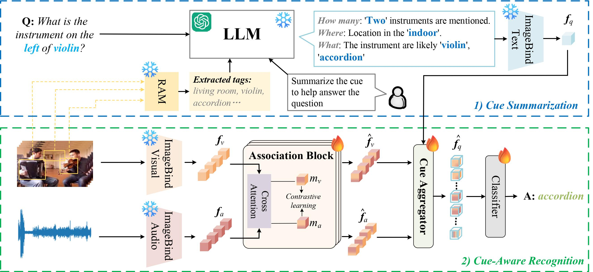
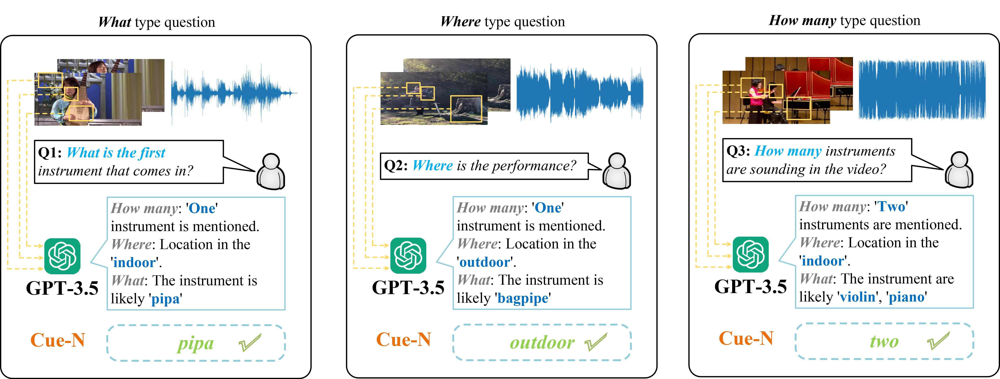

<h2 class="papername"> 
  Cue-N: Cue-Aware Network for Audio-Visual Question Answering 
:fire: The codes will be released. Stay tuned!
</h2>

 

## Introduction

Audio-Visual Question Answering (AVQA) requires reference to video content and auditory information, followed by correlating the question to predict the most precise answer. Existing methods mainly focus on querying relevant audiovisual regions using questions. However, the question itself contains very little information and fails to provide enough clues. In this paper, we use a visual language model to inject high-level visual knowledge and incorporate a Large Language Model (LLM) to expand the question to detailed cue knowledge. Then, we propose a Cue-Aware Network (Cue-N), which divides the recognition paradigm into two steps: 1) High-level semantic evidence generation via LLM. We connect visual knowledge and question content through prompt engineering to obtain summarized cues that contain "how many", "where", and "what" types of information. 2) Progressive incorporation of generated cue knowledge. We first design an association block that cooperated with contrastive learning to learn coordinated audiovisual pairs. Then, a cue aggregator is proposed to incorporate cue knowledge into the audio-visual features. Results on two publicly available datasets containing multiple question-and-answer pairs (i.e., Music-AVQA and AVQA) demonstrate the superiority of our Cue-N. During the experiment, one interesting finding behind is that removing deep audio-visual features during inference can effectively mitigate overfitting.

## Qualitative Results

